# alteryx2fabric

[](https://github.com/navintkr/alteryx-fabric-migrator/releases/latest)
[](https://pypi.org/project/alteryx2fabric/)
[](https://github.com/navintkr/alteryx-fabric-migrator/actions/workflows/release.yml)
[](LICENSE)
[](https://www.python.org/)

A toolkit for migrating Alteryx workflows (`.yxmd`) to Microsoft Fabric (Lakehouse + Notebooks + Data Pipelines), with a medallion (Bronze / Silver / Gold) architecture.

## How it works

```mermaid
flowchart LR
    subgraph Sources["Migration inputs"]
        YXMD["Alteryx workflow<br/>.yxmd"]
        DATA["Source files<br/>CSV / Excel"]
        REF["Alteryx reference outputs"]
    end

    subgraph Local["Deterministic local workflow - a2f"]
        INIT["a2f init<br/>Project folders and state"]
        PARSE["a2f parse<br/>Decode XML and parameters"]
        IR[("ir.json<br/>Tools, graph, files, parameters")]
        PLAN["a2f plan<br/>Classify support and estimate risk"]
        PLANFILES[("migration-plan.json / .md")]
        GATE{"Manual or high-risk<br/>mapping detected?"}
        APPROVE["Engineer review and approval"]
        GENERATE["a2f generate all<br/>Draft Bronze, Silver, Gold bodies"]
        BODIES[("nb_bronze.py<br/>nb_silver.py<br/>nb_gold.py")]
        CHECK["Local validation<br/>Syntax, placeholders, inputs, references"]
        PACKAGE["Package complete Fabric notebooks<br/>Helpers and Lakehouse metadata"]
        MANIFEST[(".a2f/migration.json<br/>Stage status and source fingerprint")]
    end

    subgraph Agent["Optional Copilot orchestration"]
        COPILOT["Alteryx2Fabric agent"]
        SKILL["YXMD decoding, formula mappings,<br/>architecture rules, known gotchas"]
        FABRICSKILLS["Fabric skills<br/>Spark authoring and operations"]
        COPILOT --> SKILL
        COPILOT --> FABRICSKILLS
    end

    subgraph Fabric["Approved Microsoft Fabric deployment"]
        PREFLIGHT["Online preflight<br/>Azure auth, workspace, Lakehouse"]
        LH[("Fabric Lakehouse")]
        ONELAKE[("OneLake Files/Input")]
        NB1["Bronze notebook<br/>Raw files to bronze Delta"]
        NB2["Silver notebook<br/>Migrated business logic"]
        NB3["Gold notebook<br/>Final Delta and file outputs"]
        PIPE["Fabric Data Pipeline"]
        OUTPUT[("OneLake Files/Output")]

        PREFLIGHT --> LH
        PREFLIGHT --> ONELAKE
        LH --> NB1
        ONELAKE --> NB1
        NB1 -->|Succeeded| NB2
        NB2 -->|Succeeded| NB3
        PIPE -. orchestrates .-> NB1
        PIPE -. orchestrates .-> NB2
        PIPE -. orchestrates .-> NB3
        NB3 --> OUTPUT
    end

    subgraph Verification["Parity and repair loop"]
        DOWNLOAD["Download Fabric outputs"]
        COMPARE["a2f validate<br/>Schema, rows, values, tolerance"]
        PARITY{"Exact parity?"}
        DONE["Migration complete<br/>Auditable Fabric artifacts"]
        DIAGNOSE["Spark operations diagnosis<br/>Logs, failed stage, root cause"]
        FIX["Targeted notebook correction"]

        DOWNLOAD --> COMPARE
        COMPARE --> PARITY
        PARITY -->|Yes| DONE
        PARITY -->|No| DIAGNOSE
        DIAGNOSE --> FIX
    end

    YXMD --> INIT --> PARSE --> IR --> PLAN --> PLANFILES --> GATE
    DATA --> GENERATE
    GATE -->|No| GENERATE
    GATE -->|Yes| APPROVE --> GENERATE
    GENERATE --> BODIES --> CHECK --> PACKAGE --> PREFLIGHT
    REF --> COMPARE
    OUTPUT --> DOWNLOAD
    FIX --> CHECK
    COPILOT -. invokes and reviews .-> PLAN
    COPILOT -. authors and reviews .-> GENERATE
    FABRICSKILLS -. diagnoses failures .-> DIAGNOSE
    PARSE -. records .-> MANIFEST
    PLAN -. records .-> MANIFEST
    GENERATE -. records .-> MANIFEST
    PREFLIGHT -. records .-> MANIFEST
    PIPE -. run status .-> MANIFEST
    PARITY -. validation status .-> MANIFEST
    MANIFEST -. resumes incomplete stage .-> PARSE

    classDef source fill:#f4f7fb,stroke:#52677d,color:#17212b;
    classDef local fill:#e8f3ff,stroke:#1672b8,color:#102a43;
    classDef fabric fill:#eaf7ee,stroke:#218739,color:#12351d;
    classDef decision fill:#fff4d6,stroke:#b7791f,color:#4a2c0a;
    classDef success fill:#ddf7ea,stroke:#16835b,color:#103b2c;
    classDef repair fill:#ffe9e7,stroke:#c0443a,color:#4a1713;

    class YXMD,DATA,REF source;
    class INIT,PARSE,IR,PLAN,PLANFILES,GENERATE,BODIES,CHECK,PACKAGE,MANIFEST,COPILOT,SKILL,FABRICSKILLS local;
    class PREFLIGHT,LH,ONELAKE,NB1,NB2,NB3,PIPE,OUTPUT,DOWNLOAD,COMPARE fabric;
    class GATE,PARITY decision;
    class DONE success;
    class APPROVE,DIAGNOSE,FIX repair;
```



The CLI owns deterministic and auditable operations. Copilot is optional: it reads the same plan and migration state, applies the repository skill when judgment is required, and delegates Fabric notebook authoring or failed-run diagnosis to the matching Fabric skills. Every guided migration is resumable because completed stages and the source workflow fingerprint are persisted in `.a2f/migration.json`.

The toolkit has two complementary halves:

| Half | Purpose | Where it lives |
|---|---|---|
| **CLI (`a2f`)** | Deterministic planning, preflight, packaging, deployment, execution, and validation. | `src/alteryx2fabric/` |
| **Copilot plugin** | Agent orchestration plus semantic YXMD/formula guidance and Fabric-skill delegation. | `.github/` and `skill/` |

Use the CLI for everything that should be automated. Use the Skill (via a Copilot-aware editor) for the parts that need judgment — interpreting custom formulas, mapping macros, deciding when to use a Notebook vs. a Dataflow Gen2.

## Install

**From PyPI (recommended):**

```powershell
pip install alteryx2fabric
```

**From a GitHub Release wheel:**

```powershell
pip install https://github.com/navintkr/alteryx-fabric-migrator/releases/download/v0.2.0/alteryx2fabric-0.2.0-py3-none-any.whl
```

**From source (editable, for development):**

```powershell
git clone https://github.com/navintkr/alteryx-fabric-migrator.git
cd alteryx-fabric-migrator
pipx install --editable .
```

Verify:

```powershell
a2f --help
```

## Quick start

```powershell
# 1. Install (see Install section above) and authenticate
az login --tenant <your-tenant-id>

# 2. Initialise a migration project
a2f init my-migration --workspace-id <fabric-ws-guid>
cd my-migration

# 3. Plan, generate, and validate local artifacts (resumable)
a2f migrate path/to/workflow.yxmd --inputs ./inputs

# 4. Review .a2f/migration-plan.md, then deploy with explicit approval
a2f migrate path/to/workflow.yxmd --inputs ./inputs --to-fabric --yes --run-pipeline \
    --reference ./reference_outputs --outputs ./fabric_outputs

# 5. Download and validate against Alteryx reference outputs
a2f download Files/Output --out ./fabric_outputs
a2f validate --ref ./reference_outputs --gen ./fabric_outputs
```

> **Tip:** Just want to scope a migration without any Azure setup? Skip straight to [Portfolio analysis](#portfolio-analysis-batch) — it runs entirely offline on a folder of `.yxmd` files.

## AI-assisted generation

The CLI can call a frontier model (Claude Opus 4-class or your choice) to draft notebook bodies from the parsed IR. Auth via GitHub Models (uses `GITHUB_TOKEN` or `gh auth token`) or Anthropic API directly (`ANTHROPIC_API_KEY`).

```powershell
# Generate all three notebook bodies from ir.json
a2f generate all --inputs ./inputs --out-dir notebooks

# Override provider / model
a2f generate --provider anthropic --model claude-opus-4-20250514 silver

# Explain one Alteryx tool
a2f explain 37

# Patch a notebook from a validate diff report
a2f validate --ref ref --gen gen > diff.txt
a2f fix --notebook notebooks/nb_silver.py --diff diff.txt
```

The system prompt embeds the skill's hard rules (Delta column mapping, year-9999, NULL arithmetic, etc.) so generated code follows them by default.

GitHub Models is the CLI's embedded inference provider. GitHub Copilot CLI is an optional orchestration layer supplied through the repository plugin; `a2f` does not launch Copilot as a subprocess.

## Planning, preflight, and notebook packaging

```powershell
a2f plan path/to/workflow.yxmd
a2f doctor --offline --json-output
a2f doctor --json-output
a2f package-notebooks
```

`a2f plan` classifies every tool as native, partial, manual, or unknown and emits confidence, risks, proposed artifacts, and a review recommendation. `a2f deploy` fails closed unless all three generated notebook bodies are present, syntactically valid, and free of scaffold placeholders.

The guided `a2f migrate` command records each stage in `.a2f/migration.json`. Rerunning resumes completed work; use `--restart` to invalidate all stages. Fabric writes always require `--to-fabric --yes`. With `--run-pipeline`, it downloads `Files/Output` and validates parity automatically when reference outputs are available.

## Copilot plugin

The workspace includes:

- `.github/plugin/plugin.json` for Copilot CLI plugin packaging.
- `.github/agents/Alteryx2Fabric.agent.md` for the end-to-end migration agent.
- `.github/prompts/migrate-alteryx.prompt.md` for an on-demand VS Code workflow.
- `.github/skills/alteryx2fabric/SKILL.md` as the standard discovery entry point.

The agent delegates current notebook conventions and failure diagnosis to the installed Fabric `spark-authoring-cli`, `spark-operations-cli`, and medallion architecture skills. It does not require or invoke Foundry MCP.

## Portfolio analysis (batch)

Have a folder of dozens or hundreds of `.yxmd` files and need to scope the migration? Use `a2f analyze`:

```powershell
a2f analyze C:\path\to\workflows --out .\analysis
```

Outputs in `./analysis/`:

| File | Contents |
|---|---|
| `workflow_report.csv` | Tool counts, support coverage, confidence, risks, effort days, and recommended migration wave |
| `workflow_dependencies.csv` | Edges `upstream → downstream` whenever an output file of one workflow is consumed as an input by another |
| `workflow_duplicates.csv` | Exact (identical structure hash) and near-duplicate (Jaccard ≥ threshold) clusters — candidates for consolidation |
| `workflow_analysis.xlsx` | All three sheets in one Excel workbook |
| `workflow_dependencies.mmd` | Mermaid diagram of the dependency graph |
| `portfolio_summary.json` | Aggregate workflow/tool counts, engineering days, confidence, risk, duplicates, dependencies, and capacity-assessment flag |

Tune near-duplicate sensitivity with `--near-threshold 0.85` (default 0.9).

## Workflow parameterization

Alteryx workflows often expose runtime knobs through **user constants**, **question constants** (`%Question.X%`), or **interface tools** (TextBox, Date, DropDown, NumericUpDown, etc.). The toolkit detects these automatically and surfaces them in three places:

1. **`a2f parse`** — the IR (`ir.json`) now includes a `parameters` array.
2. **`a2f analyze`** — adds a `parameter_count` / `parameters` column to the workflow report and a dedicated `workflow_parameters.csv` (and Excel sheet) listing every parameter across the portfolio.
3. **`a2f deploy`** — automatically creates matching **Fabric Data Pipeline parameters** (with type and default) and wires each notebook activity to receive them via `@pipeline().parameters.<Name>`.

At run time, override any parameter with `--param`:

```powershell
a2f run --param RegionCode=EU --param AsOfDate=2024-12-31 --param BatchSize=1000
```

Skip parameterization for a workflow with `a2f deploy --no-parameters`.

## What the toolkit does NOT do

- It does not silently approve every Alteryx mapping. Macros, spatial/predictive tools, custom tools, and uncertain formulas are surfaced as review gates.
- It does not provision capacities or workspaces. Use `az` / Fabric portal for those.
- It does not generate Dataflow Gen2 mashup PQ. Bronze ingestion currently uses notebooks; DFG2 emission is on the roadmap.

## Architecture

```
YXMD → parse → deterministic plan → notebook generation → local preflight
                                                        ↓
Alteryx references ← parity validation ← Fabric run ← approved deployment

Copilot plugin: optional planning/review/orchestration layer around the same CLI
```

## Known gotchas baked in

These come from real engagements and are encoded in both the CLI defaults and the skill instructions:

- **Delta column mapping** (`name` mode, reader v2 / writer v5) — required for Alteryx-style column names with spaces or special characters.
- **`timestampNtz` Delta feature** — avoid by serialising datetimes as strings before writing.
- **Year-9999 sentinel dates** — pandas `datetime64[ns]` overflows; use Python `datetime` objects or `datetime64[us]`.
- **NULL arithmetic** — Alteryx propagates NULLs through sums. Use `skipna=False` in pandas.
- **Join key normalisation** — Alteryx treats NaN / "" / "  " as equal in joins. Strip + fill before merging.

See [`skill/instructions/known-gotchas.md`](skill/instructions/known-gotchas.md) for the full catalogue.

## Repo layout

```
alteryx2fabric/
├── src/alteryx2fabric/        # CLI package
├── skill/                     # Agent skill (SKILL.md + instructions)
├── examples/sales-rollup-demo/ # Synthetic example workflow
├── docs/                      # Quickstart + architecture notes
├── tests/                     # Unit tests
└── pyproject.toml
```

## License

MIT. See [`LICENSE`](LICENSE).
